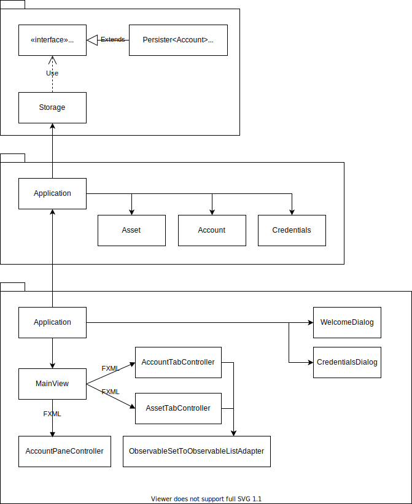

# Arkkitehtuuri

Sovellus noudattaa kerrosarkkitehtuuria, jossa on kolme kerrosta:

1. **Taltiointikerros** joka vastaa inventaarion sisältämien objektien hallinnasta
   välimuistissa ja levyllä. Taltiointikerroksen vastuulla on pitää nämä kaksi
   taltiota synkroonissa.
2. **Sovelluskerros** vastaa ns. bussiness-logiikasta, esimerkiksi käyttäjän
   todentamisesta ja oikeuksien valvomisesta sekä toimii taltioiti- ja
   käyttöliittymäkerroksen rajapintana.
3. **Käyttöliittymäkerros** vastaa graafisen käyttöliittymän luomisesta ja
   päivittämisestä, sekä käyttäjän komentojen välittämisestä sovelluskerrokselle.

## Taltiointikerros

Taltiointikerroksen toiminta keskittyy `Storage`-luokan ympärille, joka
tarjoaa metodeja objektien hakemiseen ja tallentamiseen.  `Storage`-luokka
tarjoaa myös `ObservableSet`-rajapinnat kunkin tyyppisten objektien listaamiseen
sekä objektien lisäämiseen ja poistamiseen reagointiin.  Tämä mahdollistaa
ohjelman muiden komponenttien välittömän reagoimisen taltioitujen objektien
muutoksiin.

`Storage`-luokka ei itsessään toteuta minkäänlaista persistenssiä, vaan
delegoin vastuun tästä `Persister<T>`-rajapinnen toteutuksille.  Esimerkiksi
`AccountSqlitePersister`, joka toteuttaa rajapinnan `Persister<Account>`
tarkkailee käyttäjätunnusten joukon muutoksia ja reagoi niihin välittämällä
muutokset SQLite-tietokantaan.

Persistoidut objektit noudattavat JavaFX-tyyplistä käytäntöä, jossa niiden
kentille on perinteisten gettereiden ja settereiden lisäksi n.s. property-getteri.
Tämä getteri tarjoaa `Property`-rajapinnen kyseiseen kenttään. Tämän avulla kentän
arvoa voidaan dynaamisesti muuttaa ja sen muutoksiin reagoida. Tämä mahdollistaa
persistereiden reagoinnin myös objektien sisäisten kenttien muutoksiin, jotka nekin
tallennetaan SQLite-tietokantaan.
